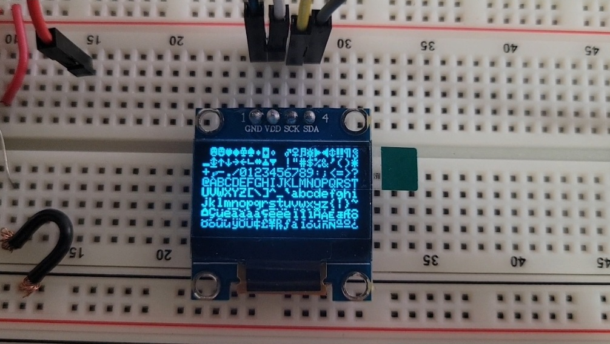

# Black-Pill I2C Display

This is a hack and slash job of a tutorial I found on the interwebs. 
It's useful to refer to the page, but a lot of the code is there.

## STM32 Black Pill

There are two variants of the Black Pill, although I suppose when using 
the Arduino library, it all compiles the same. I'd imagine, using the lower
spec software with the higher spec device would do no damage, but writing 
code for the higer spec device, and compiling it for the lower spec one 
might result in problems. 

There are two variations of the STM32 Microcontroller that come on these boards.

The Higher Spec Model is the STM32F411CEU6.

The Lower Spec Model is the STM32F401CCU6. 

For all intensive purposes they are the same, but their pinouts and capabilities
are slightly different, as well as obviously the clock speed and amount of ram
or caches that are available. 

## IDE / Building Project

I have been fortunate enough to have a subscription to Jetbrains Products, so 
I code in C++ almost exclusively with CLion, with Rider being my Visual Studio
replacement. I advocate CLion, 10 outta 10! 

With that in mind, everything I do in CLion can be done in VS Code, and there 
are even a few plugins that make it look like CLion if you want. I find it a 
bit clunky, honestly, but it's a suuper amazing free solution!

And with that in mind, whether using CLion or VS Code, your aim is to get a 
copy of platformio installed, and follow some basic tutorials online on 
setting up your ide with platformio. It wasn't too bad, if I recall, but
Google is your best friend here.

PlatformIO needed a bit of patching for CLion, but it seemed to be well 
documented, and Jetbrains is really good about incorporating their changes
into future releases, so if it doesn't get directly addressed by them soon,
it will in some future release. I'm still crossing my fingers for UE5
support, but I won't hold my breath. 

### Note on STM32CubeIDE/Programmer

I haven't gotten too familiar with STM32CubeIDE, as I'm quite content with 
CLion, however I'd like to change that. It's nice to be familiar with an 
array of tools. 

Regardless of which IDE you choose, you should definitely download and 
install the STM32CubeProgrammer though. This is a crucial tool, for 
verifying that the Black Pill is working properly. You can easily 
do a boot reset, if you somehow brick it, but that's usually not 
necessary. 

In my experience, most of the times I've tried to flash my rom over to the 
Black Pill, it doesn't work because one of the pins in my ST-Link comes 
loose. Simply pushing it back in usually works. 

Good luck!

